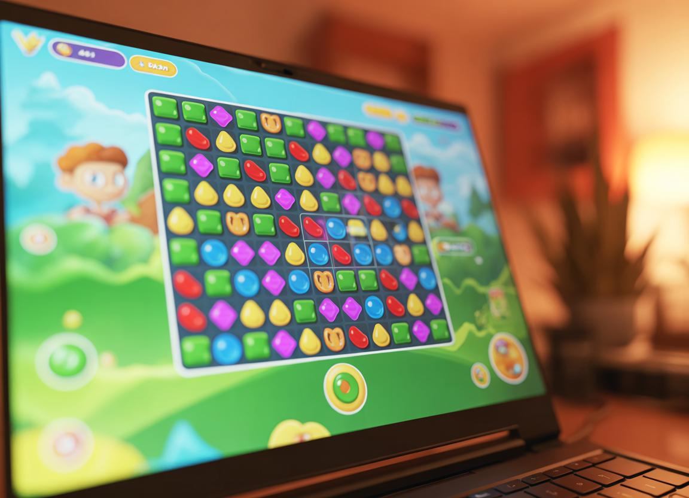
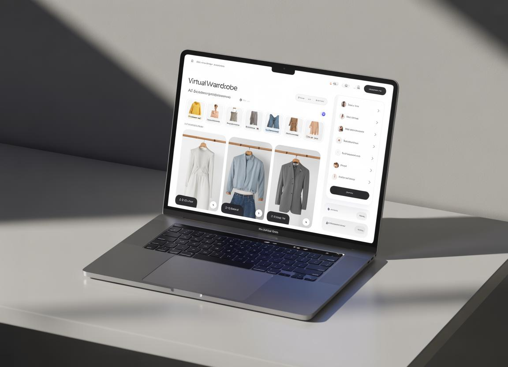
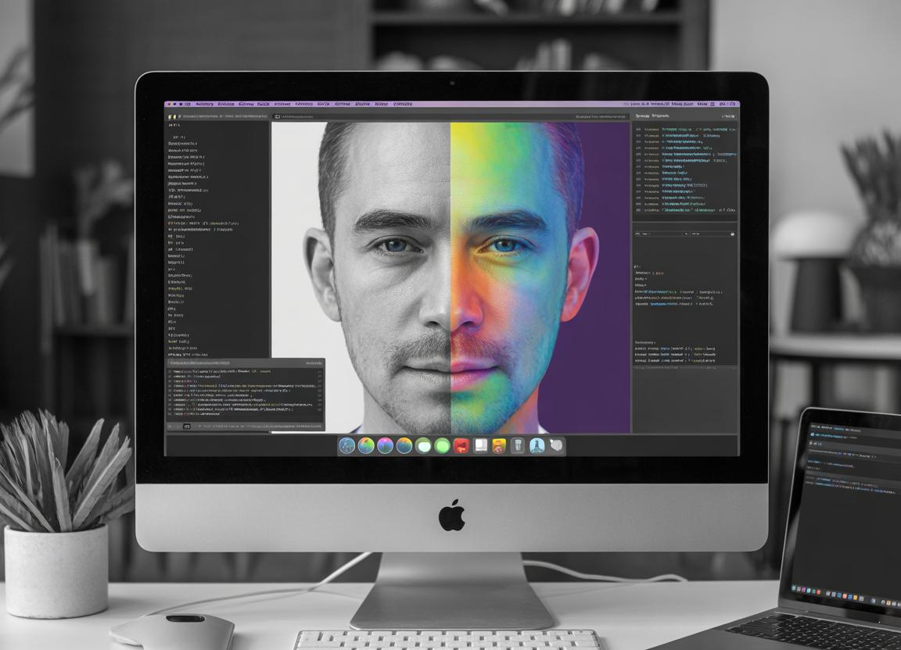
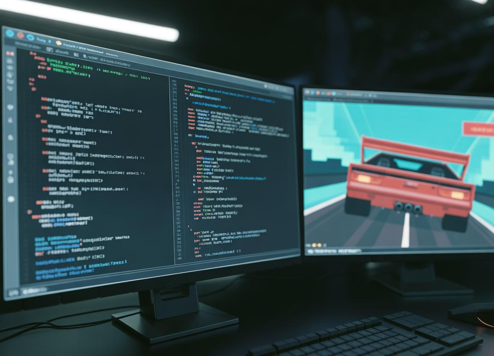
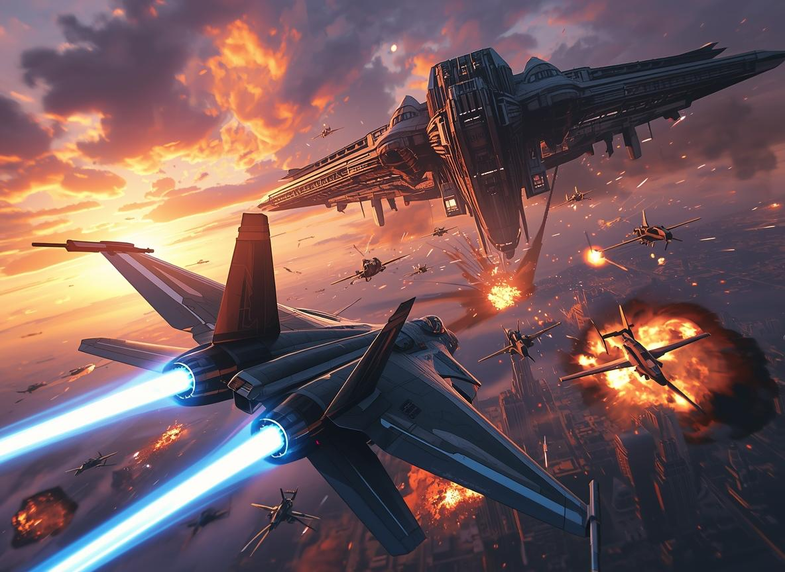

  

<h1 align="center">Hi 👋, I'm Usman Wajid</h1>

  🚀 AI Engineer | 🗄️ Database Engineer | 🖼️ Computer Vision Enthusiast

  🎓 Undergraduate @ FAST NUCES Lahore

  <a href="https://novastackltd.com">🌐 NovaStack</a> •
  <a href="https://usmanwajid.com">💼 Portfolio</a> •
  <a href="https://linkedin.com/in/usmanwajid26">🔗 LinkedIn</a>

---

  

---

## 👨‍💻 About Me

- 🔭 Building **AI-powered systems, scalable web apps & computer vision solutions**
- 🤝 Open to collaboration in **AI Engineering, Databases & Full Stack Development**
- 🌱 Learning **Deep Learning, System Design & High-performance architectures**
- 💬 Ask me about **C++, JavaScript, MERN, Databases, OpenCV**
- ⚡ Fun fact: **Football player ⚽ + Developer who blends creativity with code**

---

  

---

## 🚀 Founder Mindset

- 🚀 Co-Founder @ NovaStack  
- 💡 Building real-world tech solutions  
- 📊 Focused on AI + scalable data systems  
- 🧠 Turning ideas into impactful products  

---

  

---

## 🚀 Domains & Expertise

- 🤖 AI Engineering (Machine Learning, AI Systems) *(Current Focus)*
- 🗄️ Database Engineering (SQL / NoSQL Optimization)
- 🖼️ Digital Image Processing (Computer Vision, OpenCV)
- 🌐 Full Stack Web Development (MERN)
- 📱 Android App Development
- 🎨 UI/UX & Graphic Design
- 📈 Digital Marketing & SEO

---

## 🧠 Tech Stack

### 💻 Languages

  

### 🌐 Web

  

### 🗄️ Databases

  

MSSQL

### 🛠️ Tools

  

Slack

---

  

## 🚀 Featured Projects

  <b>✨ Interactive Portfolio Projects ✨</b>

---

### 🍬 CandyCrush Clone

  

  🎮 <b>Game Development • Logic Building • UI Interaction</b>

A fully functional Candy Crush-style puzzle game with dynamic grid mechanics and scoring system.

- 🧠 Smart matching algorithm  
- 🎯 Score tracking & progression  
- 🎨 Interactive gameplay UI  

  

---

### 👕 Virtual Wardrobe System

  

  🧥 <b>Full Stack • Database Design • User Experience</b>

A smart wardrobe management system that helps users organize outfits and get suggestions.

- 👗 Outfit categorization  
- 🤖 Smart recommendations  
- 📊 Database-driven system  

  

---

### 🎨 Pseudo Coloring (DIP)

  

  🖼️ <b>Image Processing • OpenCV • Visualization</b>

Applied pseudo-coloring techniques to grayscale images to enhance interpretation.

- 🎨 Color mapping  
- 🔍 Pixel-level transformations  
- 🧠 Computer vision concepts  

  

---

### 🏎️ ASM Racer

  

  ⚙️ <b>Low-Level Programming • Performance • Assembly</b>

A racing game built using Assembly concepts focusing on memory and performance.

- ⚡ Optimized execution  
- 🧠 Hardware-level logic  
- 🎮 Game mechanics  

  

---

### 🚀 Space Shooter

  

  👾 <b>Game Dev • AI Logic • Interactive Design</b>

An arcade-style shooter game with enemy AI and collision mechanics.

- 🎯 Shooting mechanics  
- 👾 Enemy AI  
- 💥 Collision detection  

  

---

  

---

## 📊 GitHub Stats

  

  

  

---

## 🏆 Achievements

  

---

## 📈 Contribution Activity

  

---

## 🐍 Contribution Snake

  

---

## 👀 Visitor Counter

  

---

## 🌌 Let's Connect

  <a href="https://linkedin.com/in/usmanwajid26">LinkedIn</a> •
  <a href="https://usmanwajid.com">Portfolio</a> •
  <a href="https://novastackltd.com">Company</a>

---

  

